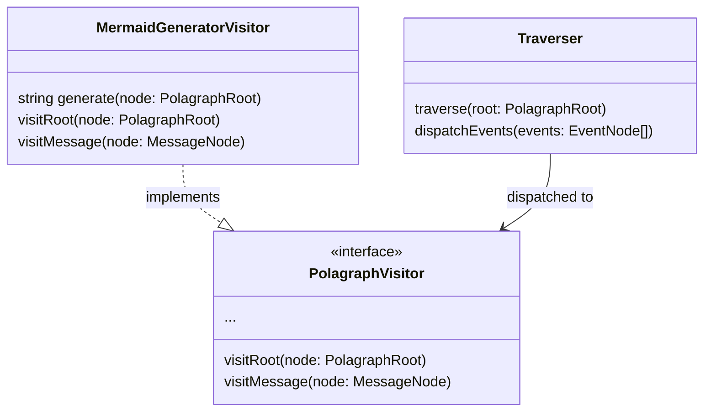

# Architecture

`@polagraph/core` is designed with extensibility and maintainability in mind, employing standard design patterns to decouple parsing logic, AST structure, and code generation.

## Directory Structure

The internal structure is organized by domain and responsibility:

- `src/index.ts`: Public API entry point.
- **`src/ast/`**: Defines the "Hub" - the central data structures.
    - `index.ts`: Type definitions for the Polagraph AST (`PolagraphRoot`, `MessageNode`, etc.).
- **`src/parser/`**: Handles Input (Parsing).
    - `index.ts`: **Factory** (`ParserFactory`) for retrieving parsers.
    - `interface.ts`: **Strategy** Interface (`DiagramParser`).
    - `base/`: Abstract base classes (`BaseLexer`, `BaseParser`) for code sharing.
    - `languages/`: Implementations for specific languages.
        - `mermaid/`: Mermaid-specific Lexer and Parser.
- **`src/generator/`**: Handles Output and Traversal.
    - `interface.ts`: **Visitor** Interface (`PolagraphVisitor`).
    - `base/`: Traversal logic (`Traverser`/Walker).
    - `generators/`: Visitor implementations for code generation.
        - `mermaid.ts`: `MermaidGeneratorVisitor`.

## Design Patterns

### 1. Parser Factory & Strategy
To support multiple input languages (Mermaid, PlantUML, etc.) uniformly, we use the **Strategy Pattern** combined with a **Factory**.

- **Strategy**: `DiagramParser` interface defines the contract (`parse(code: string): PolagraphRoot`).
- **Factory**: `ParserFactory` manages registration and retrieval of these strategies.

### 2. Visitor Pattern
To support multiple output formats and operations (Validation, Transformation) without modifying the AST nodes, we use the **Visitor Pattern**.

- **Visitor**: `PolagraphVisitor` interface defines methods for visiting each AST node type (`visitMessage`, `visitParticipant`, etc.).
- **Traverser**: The `Traverser` class handles the logic of walking the AST tree and dispatching calls to the Visitor.
- **Concrete Visitors**: `MermaidGeneratorVisitor` implements the interface to generate source code.

## Adding a New Language

### To Add a New Parser (Input)
1. Create a directory `src/parser/languages/<new-lang>/`.
2. Implement your Lexer (extending `BaseLexer`) and Parser (extending `BaseParser`).
3. Implement the `DiagramParser` interface export.
4. Register it in `src/parser/index.ts`.

### To Add a New Generator (Output)
1. Create a file `src/generator/generators/<new-format>.ts`.
2. Implement `PolagraphVisitor`.
3. Use `Traverser` to help walk the AST if needed.
